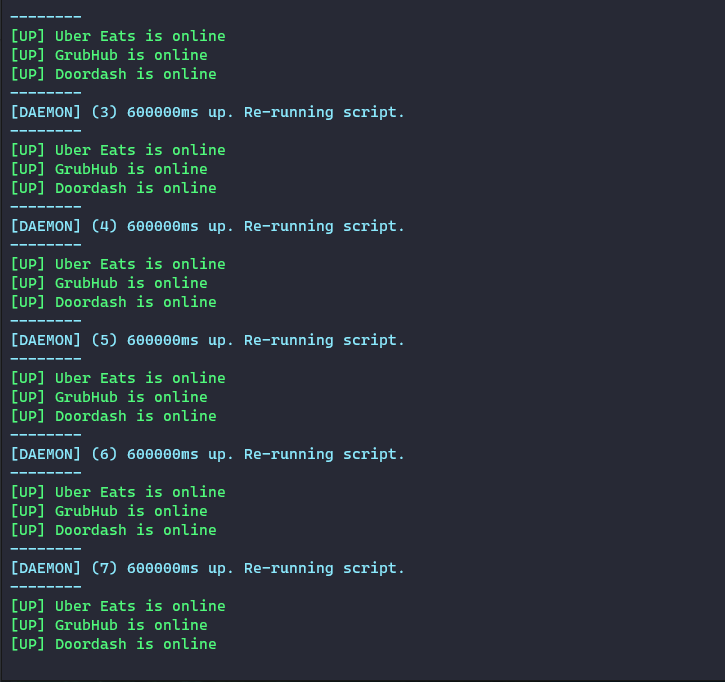

# Food Service Monitor

Monitor your Restaunt / Store's Food Service Platform availability and notify managers when it becomes unavailable to customers.

### Why?

Restaurants often becomes unavailable on food delivery service platforms and they are none the wiser. In order to prevent losing business and ensure the Managers are in the loop about restaurant unavailability, this tool was created.

## Supported Platforms

- UberEats

- Doordash

- Grubhub

#### Why does a restaurant / store go offline?

A restaurant can go offline for multiple reasons:

- Server issues on the Food Platform side

- Network connectivity issues in your restaurant / store

- Forgot to go online after a temporary blackout

- Tablet ran out of power

## Usage / Setup

1. Clone this project

`git clone https://github.com/5punk/food-service-monitor`

2. Install dependencies

`npm install`

2. Update the [configs](https://github.com/5punk/food-service-monitor/tree/master/src/config) to make it relevant to your store / restaurant (Instructions included)

3. Ensure the [notifications configuration](https://github.com/5punk/food-service-monitor/blob/master/src/config/notify.js) is upto date.

4. Update your store's / restaurant's [hours](https://github.com/5punk/food-service-monitor/blob/master/src/config/hours.js) to ensure we don't check during offline hours.

5. Run the project

## Running

This project can be run in 2 modes:

#### One time

> Best to test or when executed / paired with a cronjob / task scheduler

`npm start`

#### Daemon / Forever mode

> Best when you just want to run the command and have it loop forever (till you manually kill it).

`npm run forever`

Note: Update the [recheckTime](https://github.com/5punk/food-service-monitor/blob/master/src/config/forever.js) to reflect how often you'd like to check the status of your restaurant / store. Don't check too soon / often if you don't want your IP Address to be flagged as suspicious by any platform.

## Notifications

You obviously need to be notified when this script detects one or more of your stores as unavailable. Enable notifications and configure them [here](https://github.com/5punk/food-service-monitor/blob/master/src/config/notify.js)

#### Emails

Currently nodemailer as a transport has been implemented. What this means is you can configure the [SMTP](https://nodemailer.com/smtp/) settings or use a popular Email Platform such as [Gmail](https://nodemailer.com/usage/using-gmail/) or [Sendmail](https://nodemailer.com/transports/sendmail/) by adding the credentials for yourself right [here](https://github.com/5punk/food-service-monitor/blob/master/src/config/notify.js#L17)

#### Text to phone

You can use your phonenumber email gateway to get a text to your phone. A guide to your phonenumber's email gateway can be found [here](https://www.digitaltrends.com/mobile/how-to-send-a-text-from-your-email-account/)

#### Slack

Get Slack notifications immediately via the [Email Webhook](https://slack.com/help/articles/206819278-Send-emails-to-Slack)

#### Push Notifications

You can use a service like [Pushover](https://support.pushover.net/i29-e-mailing-notifications-to-your-devices) that supports an email gateway to push notifications to a device or a group of devices.

## Tracking

Anonymous Usage collected

No restaurant / store IDs, names, locations
or any of that sort of data collected
Just the basic running statistics to help optimize
and improve future work

You can always [opt out](https://github.com/5punk/food-service-monitor/blob/master/src/config/track.js#L6), but sending anonymous data will benefit everyone.
